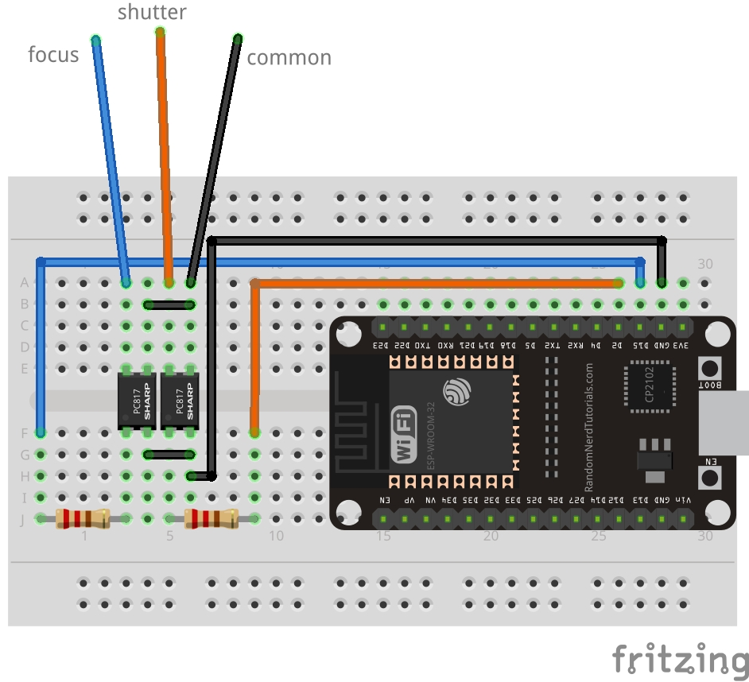
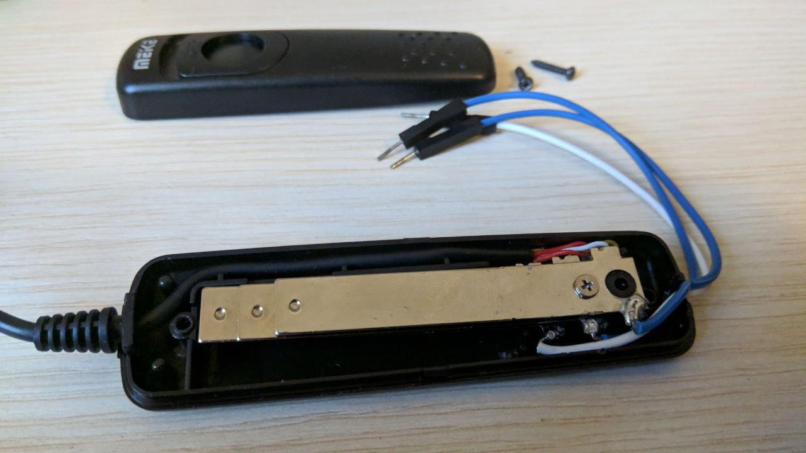

# ESP-DSLR-Trigger
An intervalometer based on an ESP32 for DSLR

## How it works
This simple intervalometer is based on an esp-32. The client connects to the esp bluetooth and sends commands via bluetooth serial and the ESP will manage the shooting of your DSLR autonomously!

## How to make your intervallometer
I bought [this](https://www.amazon.it/GIn-Telecomando-Scatto-Remoto-fotocamere/dp/B00DJ6FZ8E/ref=sr_1_37?__mk_it_IT=%C3%85M%C3%85%C5%BD%C3%95%C3%91&dchild=1&keywords=meike+nikon+d3200&qid=1595268319&sr=8-37)
remote shutter release for my Nikon. I opened it and welded cables in the slats where, if pressed the button, it made contact. After finding the common I made this small scheme and connected the transistor 
bases to pin 2 of the [ESP32](https://www.amazon.it/Sviluppo-ESP-WROOM-32-ESP-32S-Bluetooth-Antenna/dp/B071JR9WS9/ref=sr_1_4?__mk_it_IT=%C3%85M%C3%85%C5%BD%C3%95%C3%91&dchild=1&keywords=esp32&qid=1595268549&sr=8-4)  

Note: To use the ESP32 with arduino IDE you must first follow [this](https://github.com/espressif/arduino-esp32/blob/master/docs/arduino-ide/boards_manager.md) guide

Simple scheme

Internal connections 

## Commands
|          Command           |                          What it does                        |
| -------------------------- | ------------------------------------------------------------ |
| singleShot#                | Single shot. Opens the shutter and closes it after 100ms     |
| Bulb#                      | Opens the shutter until the stop command is sent             |
| timerBulb#x                | Opens the shutter for x seconds, then closes it              |
| intervallometer#x#y        | Opens the shutter every x seconds for 100ms y times          |
| bulbIntervallometer#x#y#z  | Opens the shutter every x seconds for z seconds y times      |
| af#1                       | Enable AutoFocus                                             |
| stop                       | Stop everything                                              |

### Examples
If you send this command `bulbIntervallometer#5#10#3` the shutter will open for 3s every 5s for 10 times or until you send the `stop` command  
\
If you send this command `intervallometer#5#10` the shutter will open every 5s for 10 times or until you send the `stop` command  
\
If you send this command `timerBulb#10` the shutter will open for 10s or until you send the `stop` command  
\
If you send this command `af#1` autofocus will be used
